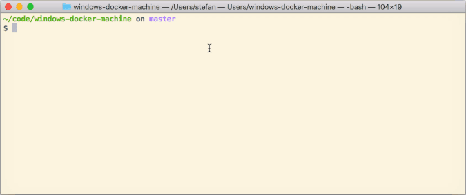

# Windows Docker Machine

This Vagrant environment creates a Docker Machine to work on your MacBook with
Windows containers. You can easily switch between Docker for Mac Linux
containers and the Windows containers.



## Three flavors

There are three flavors or versions of Windows Server 2016. This is where you
decide which Vagrant VM should be started.

* `2016` - Windows Server 2016 (10.0.14393) LTS channel
* `1709` - Windows Server, version 1709 (10.0.16299) Semi annual channel
* `insider` - Windows Server Insider builds

So with a `vagrant up 2016` you spin up the LTS version, with `vagrant up 1709`
the 1709 version and with `vagrant up insider` the Insider build.

Tested environments

* macOS with Vagrant 2.0.1
  * VMware Fusion Pro 10.0.1
  * VirtualBox 5.1.30
* Windows with Vagrant 2.0.1
  * VMware Workstation Pro 14.0.0
  * (VirtualBox see issue
    [#2](https://github.com/StefanScherer/windows-docker-machine/issues/2))
  * (Hyper-V see issue
    [#1](https://github.com/StefanScherer/windows-docker-machine/issues/1))

#### Before you begin

First you need the Windows Server 2016 VM for your hypervisor. I prefer
"Infrastructure as Code", so every build step is available on GitHub.


1. **packer build** to build a Vagrant base box, it's like a Docker image, but
   for Vagrant VM's
2. **vagrant up** to create a running VM instance of Windows Server 2016
3. **docker run** to run Windows containers in that Windows VM

Step 1 (building the headless Vagrant box) can be done with these steps:

```bash
$ git clone https://github.com/StefanScherer/packer-windows
$ cd packer-windows

$ packer build --only=vmware-iso windows_2016_docker.json
$ vagrant box add windows_2016_docker windows_2016_docker_vmware.box

- or -

$ packer build --only=vmware-iso windows_server_1709_docker.json
$ vagrant box add windows_server_1709_docker windows_server_1709_docker_vmware.box

- or -

$ packer build --only=vmware-iso windows_server_insider_docker.json
$ vagrant box add windows_server_insider_docker windows_server_insider_vmware_docker.box
```

Of course you can build only the box version you need. If you are using VirtualBox instead of VMware, 
swap `vmware` for `virtualbox` in the vagrant commands above.

## Working on macOS

### Create the Docker Machine

Spin up the headless Vagrant box you created earlier with Windows Server 2016 and Docker EE
installed. It will create the TLS certs and create a `2016` Docker machine for
your `docker-machine` binary on your Mac.

```bash
$ git clone https://github.com/StefanScherer/windows-docker-machine
$ cd windows-docker-machine
$ vagrant up --provider vmware_fusion 2016

- or -

$ vagrant up --provider virtualbox 2016
```

### List your new Docker machine

```bash
$ docker-machine ls
NAME      ACTIVE   DRIVER         STATE     URL                          SWARM   DOCKER    ERRORS
dev       -        virtualbox     Running   tcp://192.168.99.100:2376            v1.13.0
linux     -        vmwarefusion   Running                                        Unknown
2016      *        generic        Running   tcp://192.168.254.135:2376           Unknown
1709      -        generic        Running   tcp://192.168.254.136:2376           Unknown
insider   -        generic        Running   tcp://192.168.254.137:2376           Unknown
```

Currently there is [an issue](https://github.com/docker/machine/issues/3943)
that the client API version of `docker-machine` is too old. But switch Docker
environments works as shown below.

### Switch to Windows containers

```bash
$ eval $(docker-machine env 2016)
```

Now your Mac Docker client talks to the Windows Docker engine:

```bash
$ docker version
Client:
 Version:      17.03.0-ce
 API version:  1.26
 Go version:   go1.7.5
 Git commit:   60ccb22
 Built:        Thu Feb 23 10:40:59 2017
 OS/Arch:      darwin/amd64

Server:
 Version:      17.03.0-ee-1
 API version:  1.26 (minimum version 1.24)
 Go version:   go1.7.5
 Git commit:   9094a76
 Built:        Wed Mar  1 00:49:51 2017
 OS/Arch:      windows/amd64
 Experimental: true
```

### Switch back to Docker for Mac

```bash
$ eval $(docker-machine env -unset)
```

This removes all DOCKER environment variables and you can use your Docker for
Mac installation.

```bash
$ docker version
Client:
 Version:      17.03.0-ce
 API version:  1.26
 Go version:   go1.7.5
 Git commit:   60ccb22
 Built:        Thu Feb 23 10:40:59 2017
 OS/Arch:      darwin/amd64

Server:
 Version:      17.03.0-ce
 API version:  1.26 (minimum version 1.12)
 Go version:   go1.7.5
 Git commit:   3a232c8
 Built:        Tue Feb 28 07:52:04 2017
 OS/Arch:      linux/amd64
 Experimental: true
```

### Mounting volumes from your Mac machine

Just use `C:$(pwd)` to prepend a drive letter.

```bash
$ docker run -it -v C:$(pwd):C:$(pwd) microsoft/windowsservercore powershell
```

Yes, this mounts the current directory through the Windows 2016 VM into the
Windows Container.

### Accessing published ports of Windows containers

When you run Windows containers with publish ports then you can use the IP
address of the Windows Docker host to access it. The `docker-machine` binary can
give your the IP address with a command.

Example: Run the whoami Windows container and open it in the default macOS
browser.

```
$ docker run -d -p 8080:8080 stefanscherer/whoami
$ open http://$(docker-machine ip 2016):8080
```

## Working on Windows

Spin up the headless Vagrant box you created earlier with Windows Server 2016 and Docker EE
installed. It will create the TLS certs and create a `2016` Docker machine for
your `docker-machine` binary on your Windows host.

If you haven't worked with `docker-machine` yet, create the `.docker` directory
in your user profile manually.

```powershell
PS C:\> mkdir $env:USERPROFILE\.docker
```

### Create the Docker Machine

Choose your hypervisor and start the VM

```powershell
PS C:\> git clone https://github.com/StefanScherer/windows-docker-machine
PS C:\> cd windows-docker-machine
PS C:\> vagrant up --provider vmware_workstation 2016
PS C:\> vagrant up --provider virtualbox 2016
PS C:\> vagrant up --provider hyperv 2016
```

Notice: The provider `hyperv` does mount the volumes with SMB into the Win2016
VM. It seems that there is a problem mounting that further into a Windows
container. The provisioning (creating the TLS certs and copying them back to the
Windows host) will fail.

### List your new Docker machine

```powershell
PS C:\> docker-machine ls
NAME      ACTIVE   DRIVER         STATE     URL                          SWARM   DOCKER    ERRORS
dev       -        virtualbox     Running   tcp://192.168.99.100:2376            v1.13.0
2016      *        generic        Running   tcp://192.168.254.135:2376           Unknown
```

### Switch to Windows containers

```powershell
PS C:\> docker-machine env windows | iex
```

Now your Windows Docker client talks to the Windows Docker engine:

```powershell
PS C:\> docker version
Client:
 Version:      17.03.0-ce
 API version:  1.26
 Go version:   go1.7.5
 Git commit:   60ccb22
 Built:        Thu Feb 23 10:40:59 2017
 OS/Arch:      windows/amd64

Server:
 Version:      17.03.0-ee-1
 API version:  1.26 (minimum version 1.24)
 Go version:   go1.7.5
 Git commit:   9094a76
 Built:        Wed Mar  1 00:49:51 2017
 OS/Arch:      windows/amd64
 Experimental: true
```

### Switch to back to Docker for Windows

```powershell
PS C:\> docker-machine env -unset | iex
```

This removes all DOCKER environment variables and you can use your Docker for
Windows installation.

```powershell
PS C:\> docker version
Client:
 Version:      17.03.0-ce
 API version:  1.26
 Go version:   go1.7.5
 Git commit:   60ccb22
 Built:        Thu Feb 23 10:40:59 2017
 OS/Arch:      windows/amd64

Server:
 Version:      17.03.0-ce
 API version:  1.26 (minimum version 1.12)
 Go version:   go1.7.5
 Git commit:   3a232c8
 Built:        Tue Feb 28 07:52:04 2017
 OS/Arch:      linux/amd64
 Experimental: true
```

### Mounting volumes from your Windows machine

Just use `$(pwd)` in PowerShell.

```powershell
PS C:\> docker run -it -v "$(pwd):$(pwd)" microsoft/windowsservercore powershell
```

Yes, this mounts the current directory through the Windows 2016 VM into the
Windows Container.

### Accessing published ports of Windows containers

When you run Windows containers with publish ports then you can use the IP
address of the Windows Docker host to access it. The `docker-machine` binary can
give your the IP address with a command.

Example: Run the whoami Windows container and open it in the default browser.

```powershell
PS C:\> docker run -d -p 8080:8080 stefanscherer/whoami
PS C:\> start http://$(docker-machine ip 2016):8080
```

## Further commands

Here is a list of `docker-machine` commands and the equivalent Vagrant command.
I use a `bash` function
[`dm` in my dotfiles repo](https://github.com/StefanScherer/dotfiles/blob/7ce1752b3fd397797d94ff9017cbfbfd50913d78/.functions#L152-L177)
to simplify all the tasks without switching to the Vagrant folder each time.

| Docker-machine command                 | Vagrant equivalent               | dm                         |
| -------------------------------------- | -------------------------------- | -------------------------- |
| `docker-machine create -d xxx 2016`    | `vagrant up --provider xxx 2016` | `dm start 2016`            |
| `docker-machine regenerate-certs 2016` | `vagrant provision 2016`         | `dm regenerate-certs 2016` |
| `docker-machine stop 2016`             | `vagrant halt 2016`              | `dm stop 2016`             |
| `docker-machine start 2016`            | `vagrant up 2016`                | `dm start 2016`            |
| `docker-machine ssh 2016`              | `vagrant rdp 2016`               | `dm rdp 2016`              |
| `docker-machine rm 2016`               | `vagrant destroy 2016`           | `dm rm 2016`               |
| `eval $(docker-machine env 2016)`      |                                  | `dm 2016`                  |

## Insider builds

If you want to follow the Windows Server Insider builds then this is for you. It
is tested on a Mac with the following steps.

1. Register at Windows Insider program https://insider.windows.com

2. Download the Windows Server ISO from
   https://www.microsoft.com/en-us/software-download/windowsinsiderpreviewserver?wa=wsignin1.0

3. Build the Vagrant basebox with Packer

```bash
git clone https://github.com/StefanScherer/packer-windows
cd packer-windows
packer build --only=vmware-iso --var iso_url=~/Downloads/Windows_InsiderPreview_Server_2_17035.iso windows_server_insider_docker.json
vagrant box add windows_server_insider_docker windows_server_insider_docker_vmware.box
```

Then spin up your Insider machine with

```
vagrant up insider
```

This Vagrant box has Docker 17.10.0-ee-preview3 installed and the following base
images are already pulled from Docker Hub:

* microsoft/windowsservercore-insider
* microsoft/nanoserver-insider

There is also some languages and runtimes available as insider images:

* stefanscherer/node-windows
