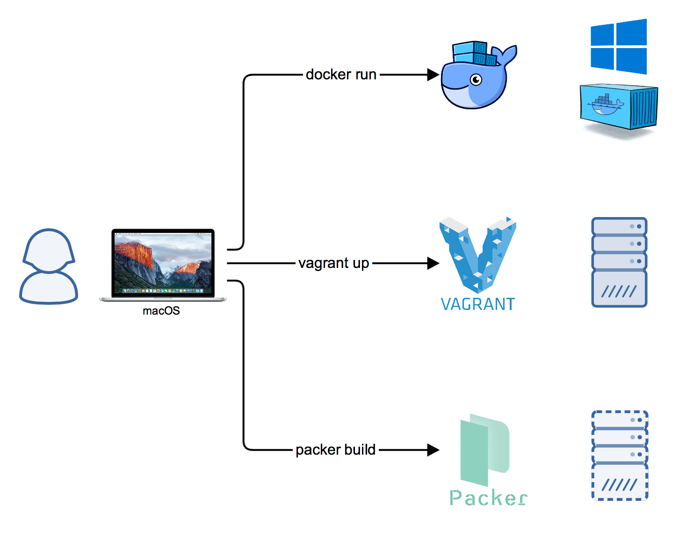

# Windows Docker Machine
[](https://ci.appveyor.com/project/StefanScherer/windows-docker-machine)

This Vagrant environment creates a "Docker Machine" to work on your MacBook with
Windows containers. You can easily switch between Docker Desktop Linux
containers and the Windows containers.

[](https://asciinema.org/a/8b0NKbNvpKxJhGThjMYCsSNbI)

## Many flavors

There are several versions of Windows Server. This is where you
decide which Vagrant VM should be started.

* `2022-box` - Windows Server 2022 (10.0.20348) LTS Channel, ___***prebuilt from Vagrant Cloud***___
* `2022` - Windows Server 2022 (10.0.20348) LTS Channel
* `2019-box` - Windows Server 2019 (10.0.17763) LTS Channel, ___***prebuilt from Vagrant Cloud***___
* `2019-box-resized` - The above, with a 80G->150G resized disk.
* `2019` - Windows Server 2019 (10.0.17763) LTS Channel
* `1903` - Windows Server, version 1903 (10.0.18362) Semi-Annual Channel
* `1809` - Windows Server, version 1809 (10.0.17763) Semi-Annual Channel
* `1803` - Windows Server, version 1803 (10.0.17134) Semi-Annual Channel
* `2016-box` - Windows Server 2016 (10.0.14393) LTS channel, ___****prebuilt from Vagrant Cloud***___
* `2016` - Windows Server 2016 (10.0.14393) LTS channel
* `insider` - Windows Server Insider builds
* `lcow` - Windows Server, version 1809 with LCOW enabled

So with a `vagrant up 2019` you spin up the LTS version, with `vagrant up 1903`
the 1903 semi-annual version and with `vagrant up insider` the Insider build.

If you don't want to run the **packer** step, you can run `vagrant up 2019-box`
or `vagrant up 2022-box` to get your box image downloaded directly from Vagrant
Cloud. That uses the box images [windows_2019_docker], respectively
[windows_2022_docker].

[windows_2019_docker]: https://app.vagrantup.com/StefanScherer/boxes/windows_2019_docker
[windows_2022_docker]: https://app.vagrantup.com/StefanScherer/boxes/windows_2022_docker

## Tested environments

* macOS with Vagrant 2.2.19
  * VMware Fusion Pro 11.0.3
  * VirtualBox 5.2.26 and 6.1.34
* Windows with Vagrant 2.2.4
  * VMware Workstation Pro 15.0.3
  * (VirtualBox see issue
    [#2](https://github.com/StefanScherer/windows-docker-machine/issues/2))
  * (Hyper-V see issue
    [#1](https://github.com/StefanScherer/windows-docker-machine/issues/1))

## Getting started

First you need a Windows Server VM for your hypervisor. I prefer
"Infrastructure as Code", so every build step is available on GitHub.



1. (optional) **packer build** to build a Vagrant base box, it's like a Docker image, but
   for Vagrant VM's. 
2. **vagrant up** to create a running VM instance of Windows Server, either using the
   `packer build` or by using one of the pre-built Vagrant Cloud binaries
   `2022-box`, `2019-box`, or `2016-box`.
3. **docker run** to run Windows containers in that Windows VM

Step 1 (building the headless Vagrant box) can be done with these steps:

```bash
$ git clone https://github.com/StefanScherer/packer-windows
$ cd packer-windows

$ packer build --only=vmware-iso windows_2022_docker.json
$ vagrant box add windows_2022_docker windows_2022_docker_vmware.box

- or -

$ packer build --only=vmware-iso windows_2019_docker.json
$ vagrant box add windows_2019_docker windows_2019_docker_vmware.box

- or -

$ packer build --only=vmware-iso --var iso_url=~/path-to-1903.iso windows_server_1903_docker.json
$ vagrant box add windows_server_1903_docker windows_server_1903_docker_vmware.box

- or -

$ packer build --only=vmware-iso --var iso_url=~/path-to-1809.iso windows_server_1809_docker.json
$ vagrant box add windows_server_1809_docker windows_server_1809_docker_vmware.box

- or -

$ packer build --only=vmware-iso --var iso_url=~/path-to-1803.iso windows_server_1803_docker.json
$ vagrant box add windows_server_1803_docker windows_server_1803_docker_vmware.box

- or -

$ packer build --only=vmware-iso --var iso_url=~/path-to-insider.iso windows_server_insider_docker.json
$ vagrant box add windows_server_insider_docker windows_server_insider_vmware_docker.box

- or -

$ packer build --only=vmware-iso --var iso_url=~/path-to-2016.iso windows_2016_docker.json
$ vagrant box add windows_2016_docker windows_2016_docker_vmware.box
```

Of course you can build only the box version you need. If you are using VirtualBox instead of VMware,
swap `vmware` for `virtualbox` in the vagrant commands above.

## Working on macOS & Linux

### Create the Docker Machine

Spin up the headless Vagrant box you created earlier. It will create the TLS
certificates and a corresponding Docker context called `2022-box` or `2019-box`.

```bash
$ git clone https://github.com/StefanScherer/windows-docker-machine
$ cd windows-docker-machine
$ vagrant up --provider vmware_desktop 2019-box

- or -

$ vagrant up --provider virtualbox 2019-box
```

If you want to use Windows Server 2022, type `2022-box` here instead.


### List your new Docker machine

```bash
$ docker context ls
NAME                DESCRIPTION                               DOCKER ENDPOINT               KUBERNETES ENDPOINT                ORCHESTRATOR
2019-box            2019-box windows-docker-machine           tcp://192.168.65.130:2376
default *           Current DOCKER_HOST based configuration   unix:///var/run/docker.sock   https://localhost:6443 (default)   swarm
dummy                                                         tcp://1.2.3.4:2375
```

### Switch to Windows containers

```bash
$ docker context use 2019-box
```

Now your Mac Docker client talks to the Windows Docker engine:

```bash
$ docker version
Client: Docker Engine - Community
 Version:           19.03.0-beta1
 API version:       1.39 (downgraded from 1.40)
 Go version:        go1.12.1
 Git commit:        62240a9
 Built:             Thu Apr  4 19:15:32 2019
 OS/Arch:           darwin/amd64
 Experimental:      false

Server: Docker Engine - Enterprise
 Engine:
  Version:          18.09.5
  API version:      1.39 (minimum version 1.24)
  Go version:       go1.10.8
  Git commit:       be4553c277
  Built:            04/11/2019 06:43:04
  OS/Arch:          windows/amd64
  Experimental:     false
```

### Switch back to Docker Desktop

```bash
$ docker context use default
```

This removes all DOCKER environment variables and you can use your Docker for
Mac installation.

```bash
$ docker version
Client: Docker Engine - Community
 Version:           19.03.0-beta1
 API version:       1.39 (downgraded from 1.40)
 Go version:        go1.12.1
 Git commit:        62240a9
 Built:             Thu Apr  4 19:15:32 2019
 OS/Arch:           darwin/amd64
 Experimental:      false

Server: Docker Engine - Community
 Engine:
  Version:          18.09.2
  API version:      1.39 (minimum version 1.12)
  Go version:       go1.10.6
  Git commit:       6247962
  Built:            Sun Feb 10 04:13:06 2019
  OS/Arch:          linux/amd64
  Experimental:     false
```

### Mounting volumes from your Mac machine

Just use `C:$(pwd)` to prepend a drive letter.

```bash
$ docker run -it -v C:$(pwd):C:$(pwd) mcr.microsoft.com/windows/servercore:1809 powershell
```

This mounts the current working directory through the Windows VM into the
Windows Container.

### Accessing published ports of Windows containers

When you run Windows containers with publish ports then you can use the IP
address of the Windows Docker host to access it. The `docker context` command in combination with `jq` can give your the IP address with a command. Alternatively `docker-machine ip` also gives you the IP address.

Example: Run the whoami Windows container and open it in the default macOS
browser.

```
$ docker run -d -p 8080:8080 stefanscherer/whoami
$ open http://$(docker context inspect 2019-box | jq -r '.[0].Endpoints.docker.Host | .[6:] | .[:-5]'):8080

- or -

$ open http://$(docker-machine ip 2019-box):8080
```

## Working on Windows

Spin up the headless Vagrant box you created earlier. It will create the TLS
certificates and a corresponding Docker context called `2022-box` or `2019-box`.

If you haven't worked with `docker context` yet, create the `.docker` directory
in your user profile manually.

```powershell
PS C:\> mkdir $env:USERPROFILE\.docker
```

### Create the Docker Machine

Choose your hypervisor and start the VM

```powershell
PS C:\> git clone https://github.com/StefanScherer/windows-docker-machine
PS C:\> cd windows-docker-machine
PS C:\> vagrant up --provider vmware_desktop 2019-box

- or -

PS C:\> vagrant up --provider virtualbox 2019-box

- or -

PS C:\> vagrant up --provider hyperv 2019-box
```

If you want to use Windows Server 2022, type `2022-box` here instead.

Notice: The provider `hyperv` does mount the volumes with SMB into the Windows Server
VM. It seems that there is a problem mounting that further into a Windows
container. The provisioning (creating the TLS certs and copying them back to the
Windows host) will fail.

### List your new Docker machine

```powershell
PS C:\> docker context ls
NAME                DESCRIPTION                               DOCKER ENDPOINT               KUBERNETES ENDPOINT                ORCHESTRATOR
2019-box            2019-box windows-docker-machine           tcp://192.168.65.130:2376
default *           Current DOCKER_HOST based configuration   unix:///var/run/docker.sock   https://localhost:6443 (default)   swarm
```

### Switch to Windows containers

```powershell
PS C:\> docker context use 2019-box
```

Now your Windows Docker client talks to the Windows Docker engine:

```powershell
PS C:\> docker version
Client: Docker Engine - Community
 Version:           19.03.0-beta1
 API version:       1.39 (downgraded from 1.40)
 Go version:        go1.12.1
 Git commit:        62240a9
 Built:             Thu Apr  4 19:15:32 2019
 OS/Arch:           darwin/amd64
 Experimental:      false

Server: Docker Engine - Enterprise
 Engine:
  Version:          18.09.5
  API version:      1.39 (minimum version 1.24)
  Go version:       go1.10.8
  Git commit:       be4553c277
  Built:            04/11/2019 06:43:04
  OS/Arch:          windows/amd64
  Experimental:     false
```

### Switch to back to Docker for Windows

```powershell
PS C:\> docker context use default
```

This removes all DOCKER environment variables and you can use your Docker for
Windows installation.

```powershell
PS C:\> docker version
Client: Docker Engine - Community
 Version:           19.03.0-beta1
 API version:       1.39 (downgraded from 1.40)
 Go version:        go1.12.1
 Git commit:        62240a9
 Built:             Thu Apr  4 19:15:32 2019
 OS/Arch:           darwin/amd64
 Experimental:      false

Server: Docker Engine - Community
 Engine:
  Version:          18.09.2
  API version:      1.39 (minimum version 1.12)
  Go version:       go1.10.6
  Git commit:       6247962
  Built:            Sun Feb 10 04:13:06 2019
  OS/Arch:          linux/amd64
  Experimental:     false

```

### Mounting volumes from your Windows machine

Just use `$(pwd)` in PowerShell.

```powershell
PS C:\> docker run -it -v "$(pwd):$(pwd)" mcr.microsoft.com/windows/servercore:1809 powershell
```

This mounts the current working directory through the Windows VM into the
Windows Container.

### Accessing published ports of Windows containers

When you run Windows containers with publish ports then you can use the IP
address of the Windows Docker host to access it. The `docker context inspect` command can
give your the IP address with a command.

Example: Run the whoami Windows container and open it in the default browser.

```powershell
PS C:\> docker run -d -p 8080:8080 stefanscherer/whoami
PS C:\> start http://$(docker-machine ip 2019-box):8080
```

## Further commands

Here is a list of `vagrant` and `docker` commands for typical actions.
I use a `bash` function
[`dm` in my dotfiles repo](https://github.com/StefanScherer/dotfiles/blob/4517216a56708acad5c2c0809f6bfafbd880aea3/.functions#L140-L182)
to simplify all the tasks without switching to the Vagrant folder each time.
The `dm` started as a shortcut for `docker-machine` commands. I have [updated the function](https://github.com/StefanScherer/dotfiles/commit/2e771b023d97d9ec91fb20633204903c9f3b21eb#diff-e39ded4129d0efa321423853506c0116) to work with `docker context`, but rolled back for now as I prefer the environment variables to have different "contexts" per terminal tab.

| dm shortcut                    | Vagrant / Docker command             |
| ------------------------------ | ------------------------------------ |
| `dm start 2019-box`            | `vagrant up --provider xxx 2019-box` |
| `dm regenerate-certs 2019-box` | `vagrant provision 2019-box`         |
| `dm stop 2019-box`             | `vagrant halt 2019-box`              |
| `dm start 2019-box`            | `vagrant up 2019-box`                |
| `dm rdp 2019-box`              | `vagrant rdp 2019-box`               |
| `dm rm [-f] 2019-box`          | `vagrant destroy [-f] 2019-box`      |
| `dm 2019-box`                  | `docker context use 2019-box` or <br/> `eval $(docker-machine env 2019-box)`       |
| `dm ip 2019-box`               | <code>docker context inspect 2019-box &#124; jq -r '.[0].Endpoints.docker.Host &#124; .[6:] &#124; .[:-5]'</code> or <br/> `docker-machine ip 2019-box` |

## Insider builds

If you want to follow the Windows Server Insider builds then this is for you. It
is tested on a Mac with the following steps.

1. Register at Windows Insider program https://insider.windows.com

2. Download the Windows Server ISO from
   https://www.microsoft.com/en-us/software-download/windowsinsiderpreviewserver?wa=wsignin1.0

3. Build the Vagrant basebox with Packer

```bash
git clone https://github.com/StefanScherer/packer-windows
cd packer-windows
packer build --only=vmware-iso --var iso_url=~/Downloads/Windows_InsiderPreview_Server_en-us_18356.iso windows_server_insider_docker.json
vagrant box add windows_server_insider_docker windows_server_insider_docker_vmware.box
```

Then spin up your Insider machine with

```
vagrant up insider
```

This Vagrant box has Docker installed and the following base
images are already pulled from Docker Hub:

* mcr.microsoft.com/windows/servercore/insider
* mcr.microsoft.com/windows/nanoserver/insider

## LCOW

You can try the Linux Container on Windows feature in a separate machine `lcow`.
It is preconfigured to use the Windows Server, version 1903. But you can
also use Windows Insider Server Preview as base box.

```
vagrant up lcow
docker context use lcow
docker run alpine uname -a
```

## Cleanup

If you want to cleanup your machine again after playing with Windows Containers, use the following commands

```
vagrant destroy -f
vagrant box remove StefanScherer/windows_2019_docker
docker context rm 2019-box
```
